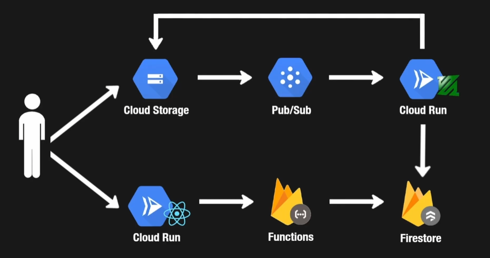

# WatcherX 

WatcherX is a serverless video ingestion and processing system built on Google Cloud Platform (GCP). Authenticated users can upload videos, which are automatically transcoded to 360p, stored, and tracked—enabling efficient streaming and management of video assets.

## Features

* **Secure Uploads**: Only authenticated users can request signed URLs for uploading raw videos.
* **Serverless Architecture**: Utilizes Cloud Functions, Pub/Sub, Cloud Run, Cloud Storage, and Firestore.
* **Automated Transcoding**: Videos are transcoded to 360p using `ffmpeg` in Cloud Run.
* **Scalable**: Auto-scaling Cloud Run workers process videos in parallel.
* **Simple Access**: Processed videos are publicly accessible from Cloud Storage.
* **Metadata Tracking**: Processing status and metadata stored in Firestore.

## Architecture Diagram

> [!NOTE]
> Frontend is done solely for authentication purposes, full use of web-client is not performed...yet.



```
[Authenticated User]
        |
        v
gRPC/HTTPS Request (signed URL)
  Cloud Functions
        |
        v
generated Signed URL          
        |
        v            Pub/Sub → Cloud Run Worker → Firestore
 Raw Bucket → [User Upload]  → Video Transcoding → Processed Bucket
```

### Prerequisites

* [Google Cloud SDK](https://cloud.google.com/sdk/docs) (`gcloud` and `gsutil`)
* Node.js (>=14.x)
* `ffmpeg` installed
* A GCP project with billing enabled


## Project Structure

```
WatcherX/
├── functions/            # Cloud Functions code (signed URL)
├── worker/               # Cloud Run worker code (ffmpeg processing)
├── .env.example          # Environment variable template
├── README.md             # This file
└── LICENSE
```

## Contributing

Contributions are welcome! Please open an issue or submit a pull request:

1. Fork the repo
2. Create a feature branch (`git checkout -b feature-name`)
3. Commit your changes (`git commit -m 'Add new feature'`)
4. Push to the branch (`git push origin feature-name`)
5. Open a pull request

## License

This project is licensed under the MIT License. See the [LICENSE](LICENSE) file for details.

---

## Detailed description: 

### Video Upload and Processing Workflow

#### Uploading a Video to Cloud Storage Bucket

1.1. Only authenticated users are allowed to upload videos using web-client.

1.2. web-client makes a request to Cloud Functions (as a REST API).

1.3. The Cloud Functions interact with Cloud Storage to generate a signed URL, which allows the authenticated user to upload a video to a raw video bucket.

#### After Uploading the Video

2.1. This triggers a message sent to Pub/Sub (a message queue), which pushes the message to a Cloud Run service.

2.2. The Cloud Run service acts as a video processing worker, using ffmpeg to transcode the uploaded video to 360p (to reduce memory and payload load).

2.3. After processing, the video is uploaded to Cloud Storage in a `/processed-videos` directory.

2.4. The processed videos can be accessed by any user directly from Cloud Storage.

2.5. The Cloud Run service writes metadata (such as the processing status) to Firestore for tracking and accessibility.


Main Functions:
```
    GenerateUploadUrl 
    video-processing-service
```
